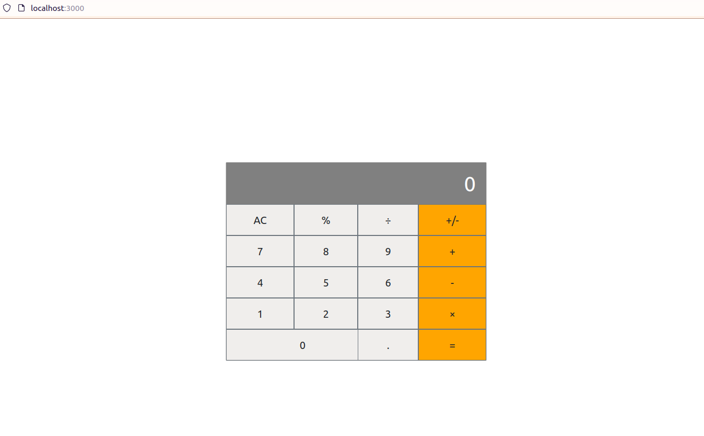

# Math-magician-app

"Math magicians" is a website for all fans of mathematics. It is a Single Page App (SPA) that allows users to:

- Make simple calculations.
- Read a random math-related quote.




## Built With

- Javascript
- HTML 5
- CSS 3
- React

## Usage
### Local installation
```console
$ git clone git@github.com:angelacuahutle/math-magicians-app.git
$ cd math-magicians-app
$ npm install 
```

### To run the project
```console
$ npm start 
```

## Live Demo

[Live Demo Link](#)

## Authors

👤 **Angela Cuahutle**

- GitHub: [@angelacuahutle](https://github.com/angelacuahutle)
- LinkedIn: [Angela Cuahutle](https://www.linkedin.com/in/angelacuhautle)

## 🤝 Contributing

Contributions, issues, and feature requests are welcome!

Feel free to check the [issues page](https://github.com/angelacuahutle/math-magicians-app/issues/new).

## Show your support

Give a ⭐️ if you like this project!!

## 📝 License

This project is [MIT](./LICENSE) licensed.